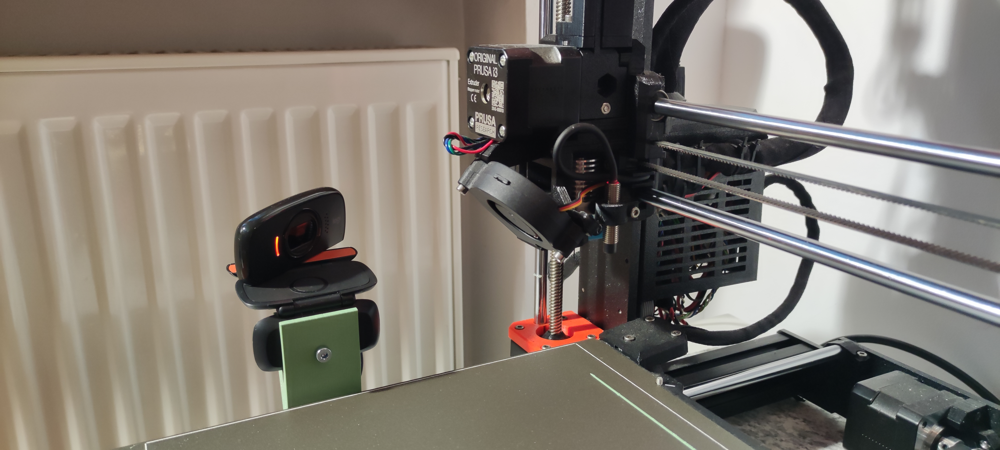
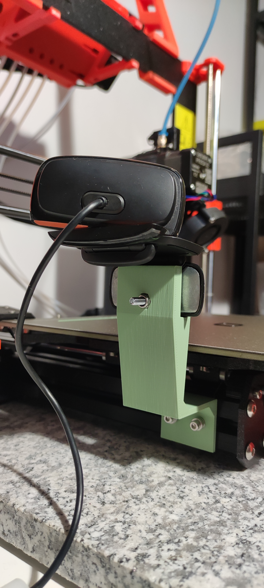

# Extrusion camera mount
I wanted a simple, sturdy, but also tiny, bolt-on camera mount for my Prusa i3
and super old webcam with no tripod mount. All the other models were either too
large, or snap-on, so I made this one.

| Front | Back |
|:-----:|:------:|
|  |  |

## Build manual

### Quick build
Head on over to [printables.com](https://www.printables.com/model/307016-3030-extrusion-webcam-mount) . The model there supports a Logitech C525 HD.

### Customizing
You can customize this build to fit any extrusion, bolts and camera you have
laying around. Open `mount.scad` in OpenSCAD, and use the customizer.
